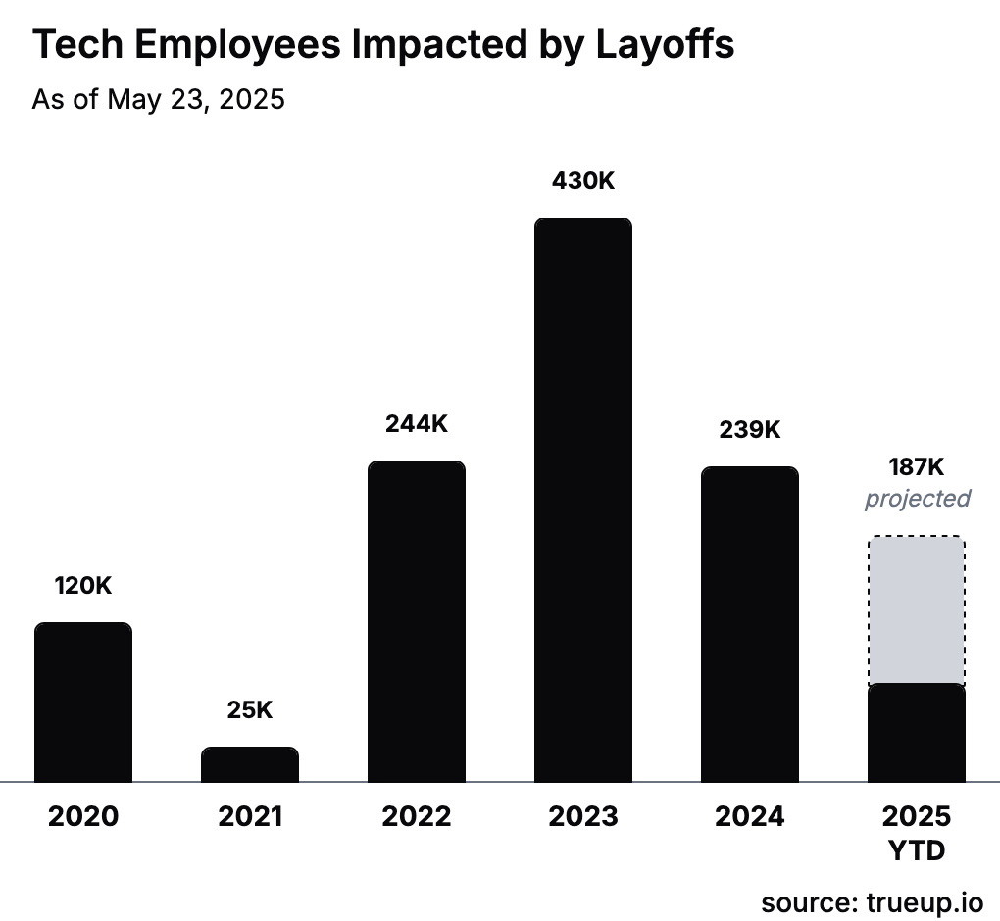

# Thực trạng

## Khó khăn

Trong năm 2023, hơn 400.000 nhân sự trong ngành công nghệ đã bị sa thải. Đến năm 2024, số lượng nhân viên bị sa thải tiếp tục ở mức cao, với hơn 200.000 người mất việc. Trong làn sóng cắt giảm này, vị trí lập trình viên phần mềm chịu ảnh hưởng nặng nề nhất. Khi các công ty tinh giản bộ máy, ứng viên junior buộc phải cạnh tranh trực tiếp với các senior dày dạn kinh nghiệm, khiến cơ hội tìm việc cho người mới ngày càng khó khăn hơn.

Bên cạnh đó, xu hướng làm việc từ xa và thuê ngoài (outsourcing) ngày càng phổ biến, làm cho các công việc theo mô hình truyền thống trở nên ít đi và khó tiếp cận hơn.

## Nhìn lại lịch sử

- **2000**: Internet bắt đầu phổ biến, kéo theo nhu cầu phát triển ứng dụng và website tăng mạnh.
- **2015**: Thị trường việc làm ngành CNTT tăng trưởng bùng nổ, nhiều cơ sở đào tạo ngành công nghệ thông tin ra đời.
- **2020**: Các mô hình trí tuệ nhân tạo xuất hiện, mở ra nhiều kỳ vọng về ứng dụng vào đời sống thực tiễn.
- **2021**: Thời kỳ đỉnh cao của ngành IT, nhu cầu tuyển dụng tăng vọt — một phần do ảnh hưởng của đại dịch COVID-19 thúc đẩy chuyển đổi số.
- **2022**: Bước ngoặt của ngành. Sau thời gian tăng trưởng nóng, thị trường bắt đầu bước vào giai đoạn điều chỉnh — điều tất yếu trong mọi chu kỳ phát triển.
- **2023**: Ghi nhận là năm cao điểm của các đợt sa thải nhân sự.
- **2024**: Xu hướng cắt giảm vẫn tiếp diễn nhưng đã bắt đầu có dấu hiệu hạ nhiệt.

## Hy vọng

- Năm 2023 có thể xem là đỉnh điểm của làn sóng sa thải. Dự báo năm 2025 sẽ là thời điểm kết thúc chu kỳ này, mở ra kỳ vọng phục hồi cho thị trường.
- Trí tuệ nhân tạo chưa thể thay thế hoàn toàn con người. Mã nguồn do AI tạo ra vẫn cần được con người xem xét và chỉnh sửa. Sẽ là sai lầm nếu cho rằng AI ra đời sẽ khiến lập trình viên mất việc hoàn toàn. Trên thực tế, chỉ những lập trình viên kỹ năng thấp mới dễ bị thay thế; còn những người có chuyên môn cao vẫn luôn được săn đón.
- Sự phát triển của các công ty AI cũng đồng nghĩa với việc xuất hiện thêm nhiều cơ hội việc làm mới trong chính các doanh nghiệp này.
